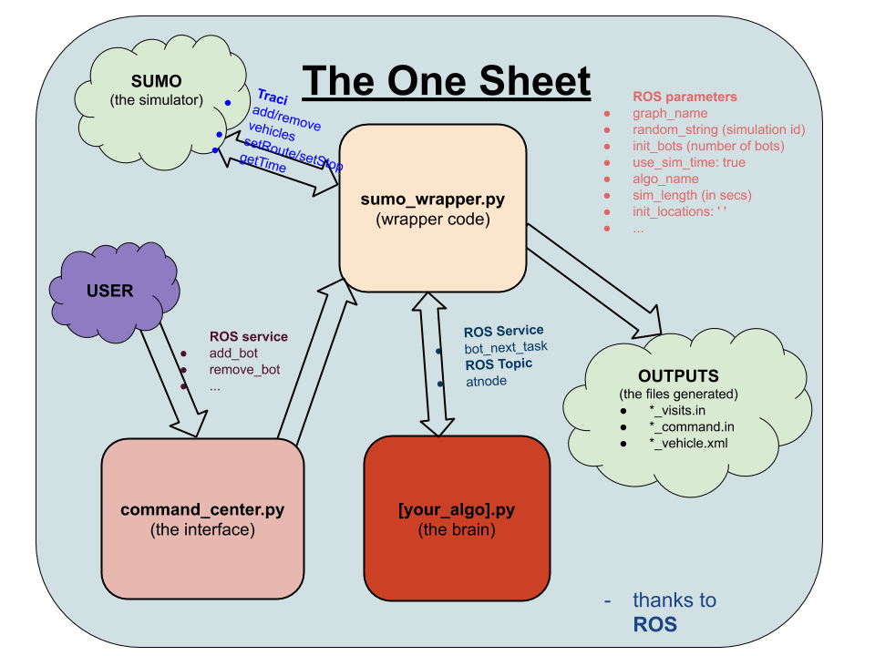

# mrpp_sumo
Platform to test MRPP algorithms in SUMO via ROS

## Dependencies
- [SUMO](https://www.eclipse.org/sumo/)
- [ROS - Melodic](http://wiki.ros.org/melodic/Installation/Ubuntu)
- Python Packages

      python3 -m pip install networkx configparser pandas seaborn numpy threaded rospkg catkin_pkg kaleido

## Installation
- Clone into your ros workspace
- Add the following to your .bashrc script

      export SUMO_HOME=/usr/share/sumo
      export PYTHONPATH=$SUMO_HOME/tools:$PYTHONPATH

- Ensure that the scripts are executable

      chmod -R 755 /path/to/mrpp_sumo/scripts/
      

- Enjoy!(?)

## How to use

### The One Sheet

### Adding a graph
- Create a sumo compatible representation for the required environment with [graph_name].net.xml, [graph_name].nod.xml and [graph_name].edg.xml files and add it to the graph_sumo folder.
- Create a [graph_name].sumocfg file by copying an existing .sumocfg file and replacing the 'net-file' attribute value with [graph_name].net.xml 
- Create a [graph_name].graphml file by running
      
      
      python3 scripts/sumo_to_graphml.py [graph_name]

  This file stores the graph information in a NetworkX compatible format.
  
### Adding an MRPP algorithm

Coming Soon

### Pre Process
- Add a *.yaml file to the /config folder with the required rosparameters (here's a list of required parameters) 
    - graph (name of the graph)
    - random_string (simulation id)
    - init_bots (number of bots)
    - use_sim_time: true 
    - algo_name 
    - sim_length (in secs)
    - init_locations: '' (if empty, locations picked at random)
  
  You may need to add additional parameters depending on the patrolling algorithm.

- Add a *.graphml file in ./graph_ml folder and a *.nod.xml, *.edg.xml, *.net.xml, *.sumocfg in /graph_sumo for the corresponding graphs

- Create a ./outputs folder (if not already)

### Running a simulation
    roscore
    rosparam load path_to_yaml_file
    rosrun mrpp_sumo sumo_wrapper.py
    rosrun mrpp_sumo path_to_algo_file
    rosrun mrpp_sumo command_center.py

Alternatively

    ./tpbp.sh path_to_yaml_file

### Post Process
Find the following files in /outputs folder
- *_command.in
Contains the sequence of walks sent by your algo_file. 4 lines per command (time_stamp, bot_name, node_id sequence, time of departure (can be empty))
- *_visits.in
Contains the sequence of visits excuted by the bots. 3 lines per visit (time_stamp, node_ids, bot_ids)
- *_vehicle.xml
Output from SUMO file

## To Do
- Add scripts to generate plots for analysis 
- Lots of other cool stuff
